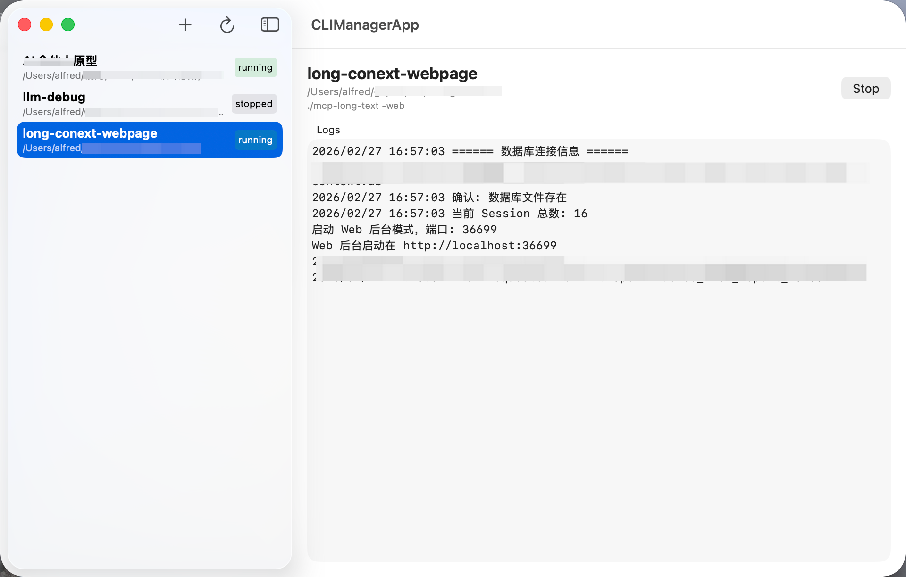

# CLIManager

CLIManager is a lightweight macOS app to organize and run commands across many local projects from one place. It is designed for people who constantly hop between directories and want a single, simple control panel to start/stop tasks and view logs.



## Features

- Track multiple projects with name, path, and start command
- Start/stop processes and see their running status
- View recent logs in-app
- Stores data locally in Application Support

## Usage

1. Add a project with:
   - Name
   - Path (must exist and be a directory)
   - Start Command (for example: `npm run dev`)
2. Select a project to view details and logs.
3. Use **Start** / **Stop** to control the process.

## CLI Import API

CLIManager also exposes a CLI entrypoint for automation:

```bash
swift run CLIManagerCLI import --path /absolute/path/to/project
```

To install the global `climanager` command from a source checkout:

```bash
swift run CLIManagerCLI install-cli
```

Optional flags:

- `--name "Custom Name"`
- `--command "npm run dev"`
- `--dry-run`
- `install-cli --target ~/bin/climanager`

The command prints a JSON result with:

- `action`: `created`, `unchanged`, or `preview`
- `project`: the registered project record
- `projectsFile`: the `projects.json` path used

Inside the app, use the `Automation` toolbar button to view the import command, copy it, and reveal the CLIManager data location in Finder.
The same panel can install the bundled `climanager` command and the app will auto-refresh when external imports update `projects.json`.

## Skill

This repo also ships the `climanager-register-project` skill for agent ecosystems such as skills.sh.

Install from GitHub with:

```bash
npx skills add https://github.com/snowshadow/CLIManager.git --skill climanager-register-project
```

## Build & Run

Requirements:
- macOS 13+
- Swift 6

Build:

```bash
swift build
```

Run the app:

```bash
swift run CLIManagerApp
```

Run tests:

```bash
swift test
```

## Data Storage

Data is stored in:

`~/Library/Application Support/CLIManager/`

Files:
- `projects.json`
- `runtime_state.json`
- `logs/`

## License

MIT
